# go-z2zloader

an Anti- Virus demo using go

# 介绍

学习了一段时间go和免杀 做了个小demo，欢迎交流学习

同时也是自己学习的途径，后面会加进度条，颜色新字体这些自己觉得好玩的东西

## 静态加密

aes+base64，使用分离加载不用担心原生文件被杀

## 动态

直接调用syscal底层函数，挺老的办法没想到还能用

线程注入可以用，会被360核晶杀

还尝试了APC注入，但是有时候上不了线

## 其他

还在考虑加入junkcode模块

## 反沙箱

发现微步识别内存大小检测为反虚拟机技术，就改成了系统语言检测，多因素判断是否在沙箱中，目前效果一般


# 使用

## 1.0

cs stageless生成raw shellcode

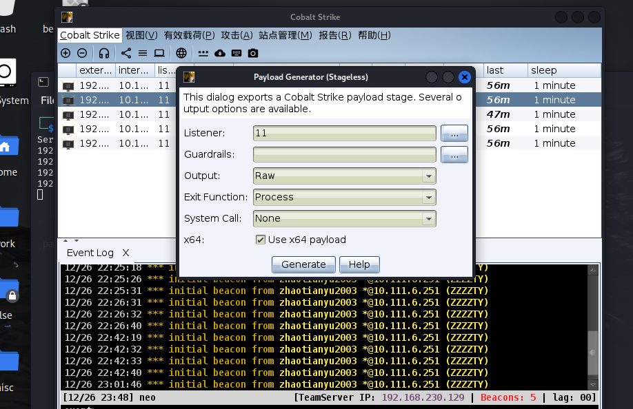

```
首先在main函数中调用encode模块 加密原生shellcode
然后选择使用本地（Original）还是远程（remote）模块，远程模块也是在开启web服务的目录下放置一个加密后的shellcode

1.不注释第11行，输入原生shellcode加密
go run main.go 
2.选择加密模式，输入加密后的bin文件
go build -ldflags="-s -w" -o 输出exe文件名 main.go
```

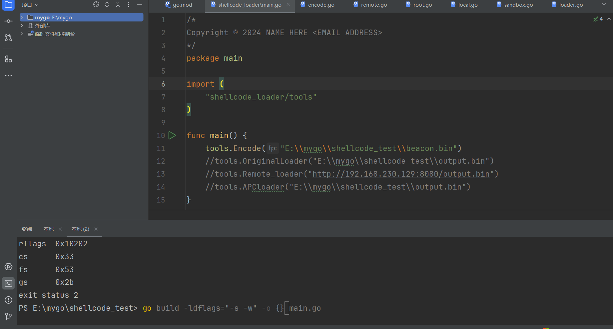


## 2.0

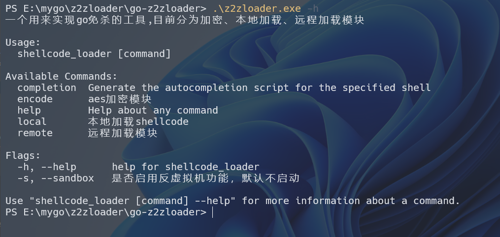

分为encode local remote模块 

比较重要的是local模块

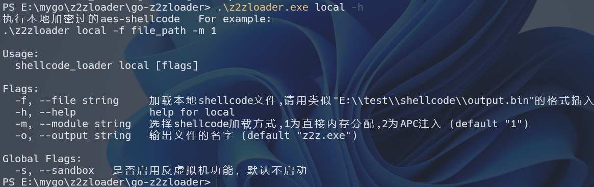

必要参数为f

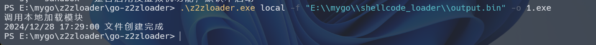

在output目录下找到exe文件


# 免杀效果

加密后的bin文件

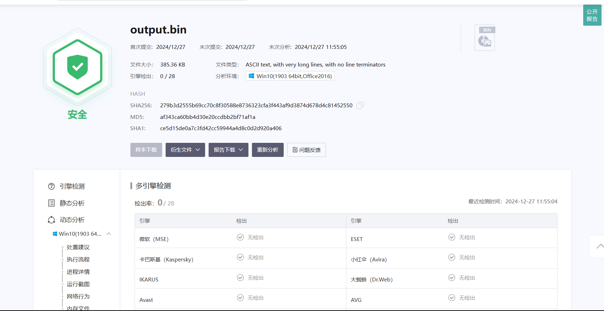

生成的exe过火绒 df 360

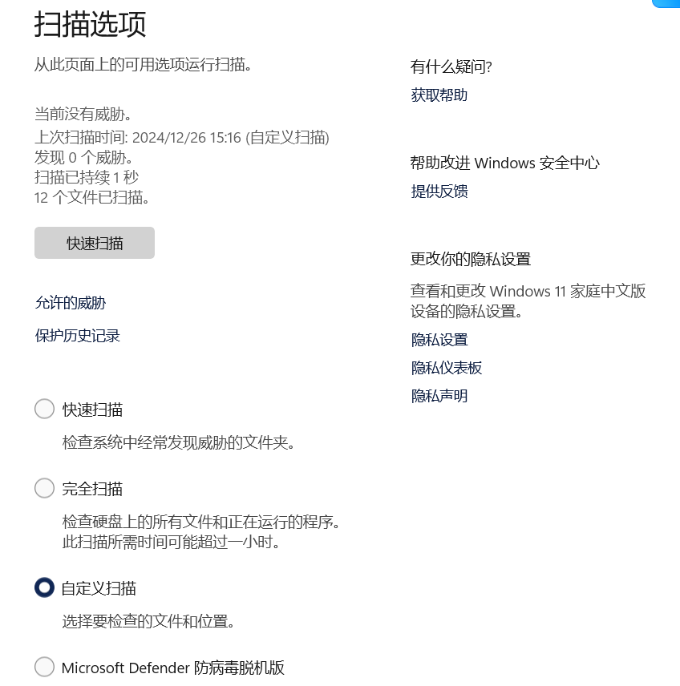


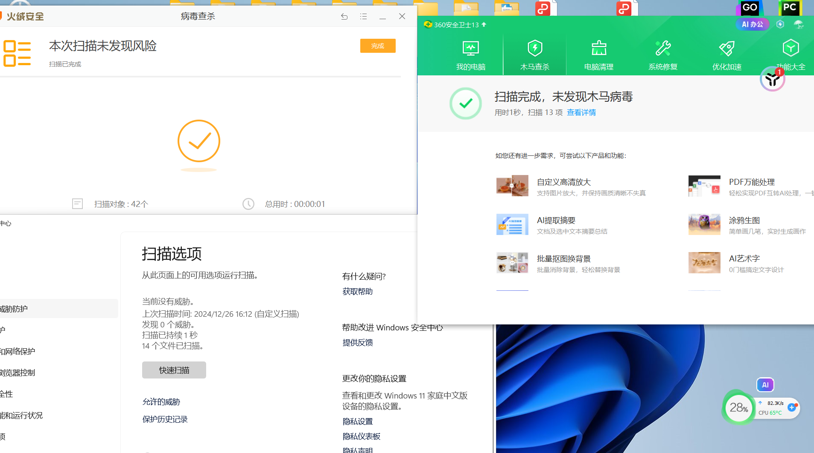


上线

360

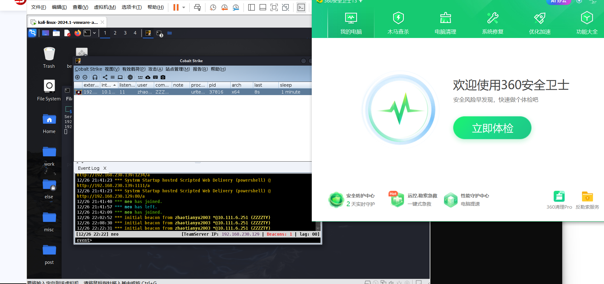

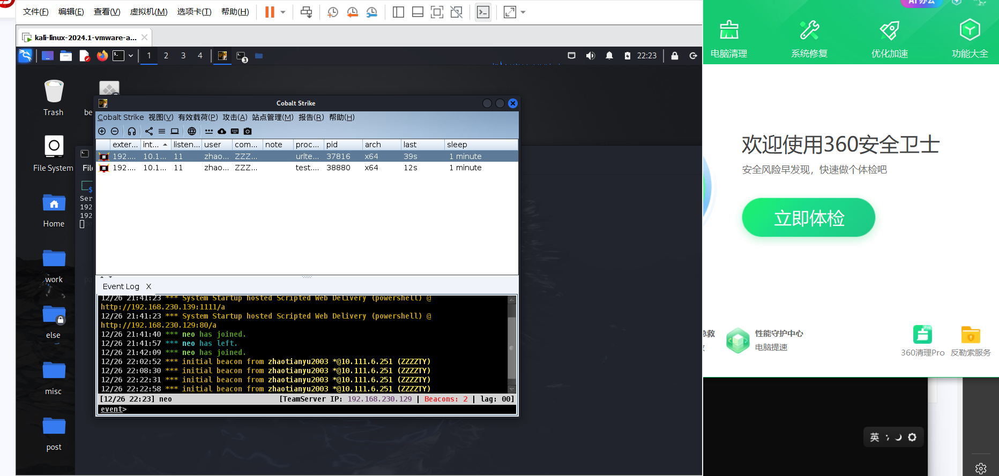

核晶

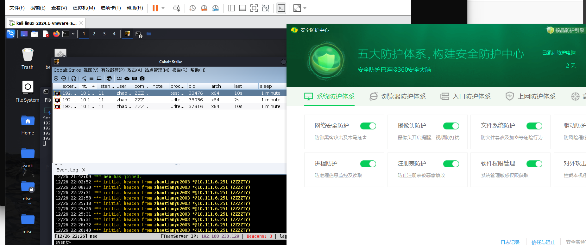

火绒

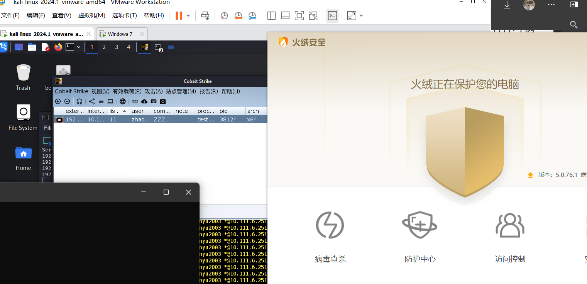


exe沙箱结果

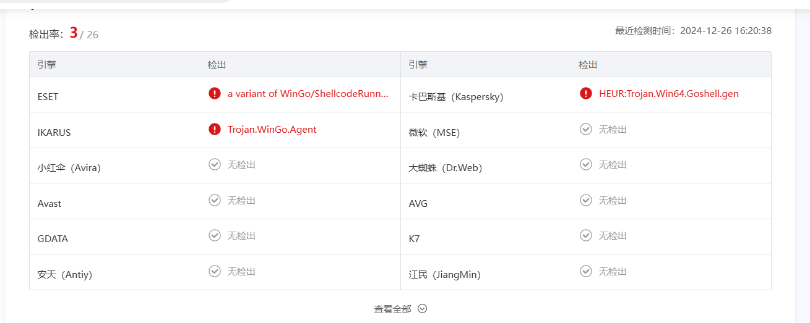


# 后续

## 问题

- 添加免杀模块，尝试更好的过沙箱

- 免黑框

- 文件体积太大

- 打包成exe（OK!）

  

## 12.28

想到一个笨办法 让工具可以动态编译文件了

APC模块还是不行，线程执行shellcode会被360杀

尝试了以下两个库去掉黑框但是没成功 有懂的大佬求教教

```
github.com/lxn/win
github.com/gonutz/ide/w32
```


# 学习资料

[Junk-Go-Generator/Junk Code Generation.go at master · SaturnsVoid/Junk-Go-Generator](https://github.com/SaturnsVoid/Junk-Go-Generator/blob/master/Junk Code Generation.go)

[go实现免杀(实用思路篇) | CN-SEC 中文网](https://cn-sec.com/archives/2839255.html)

[（●´3｀●）好啦好啦](https://shut-td.github.io/CS远控免杀思路与实现/)

[免杀技术 - go shellcode 加载 bypassAV | Hyyrent blog](https://pizz33.github.io/posts/4ac17cb886a9/)

https://github.com/HZzz2/go-shellcode-loader
